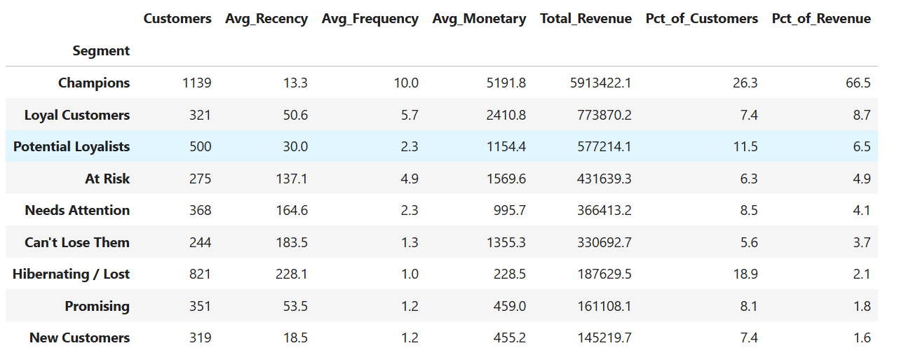
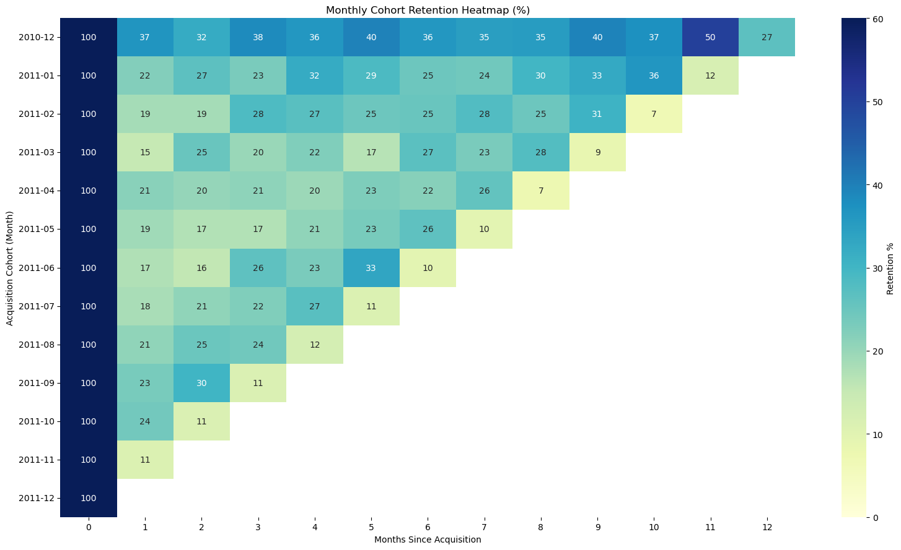
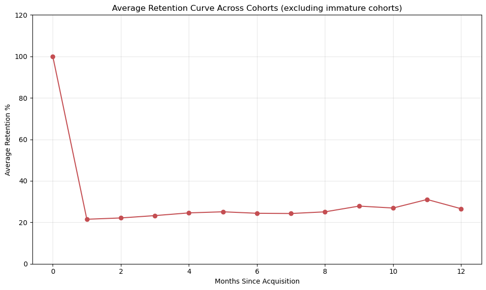
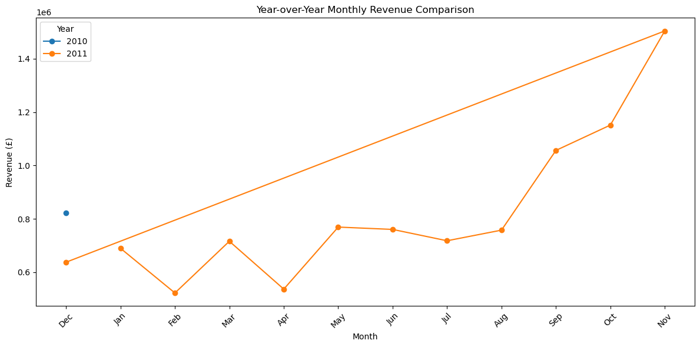
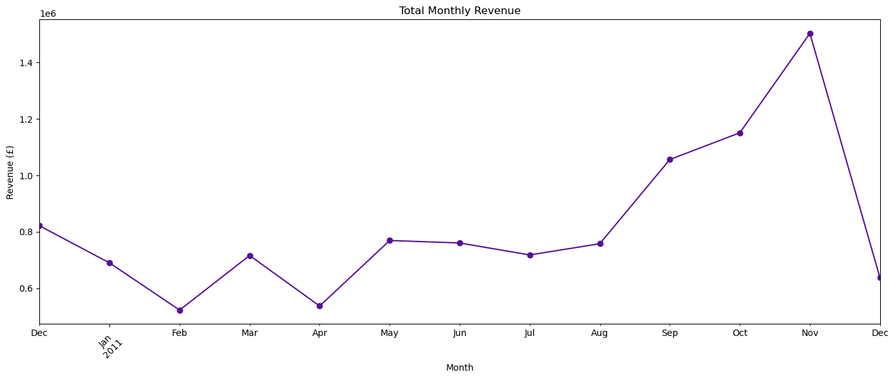

# UK E-Commerce Data Analysis

An end-to-end data analytics project analyzing transactional data from a UK-based online retailer. The project covers data cleaning, customer segmentation, cohort retention analysis, revenue trends, and business recommendations.

## 🔎 Project Overview

This project analyzes the **UK Online Retail dataset** containing **541,909 transaction line items** collected between **December 2010 and December 2011**.

The analysis transforms raw transactional data into business-focused insights around:

- Customer behavior and segmentation
- Customer retention
- Revenue concentration
- Sales seasonality
- Product performance
- Geographic revenue distribution
- Order-value patterns
- Business/customer operating patterns

The final analysis is presented as an interactive web report.

[](https://ecom-blush-seven.vercel.app/)

---

## 📊 Dataset

**Source:** [Kaggle — Online Retail Dataset](https://www.kaggle.com/datasets/carrie1/ecommerce-data)

### Original Dataset

- **Rows:** 541,909
- **Columns:** 8
- **Period:** December 2010 – December 2011
- **Business:** UK-based online retailer
- **Customer base:** Primarily wholesale/B2B customers

### After Cleaning

- **Valid sales line items:** 524,878
- **Identified customers:** 4,338
- **Products:** ~4,000
- **Countries:** 38

---

## 🧹 Data Cleaning

The raw dataset was audited and cleaned before performing customer-level and revenue-level analysis.

Key cleaning decisions included:

- Separating cancelled invoices instead of treating them as normal sales.
- Removing rows with zero or negative quantities.
- Removing rows with zero or negative prices.
- Retaining transactions without `CustomerID` for revenue-trend analysis.
- Excluding unidentified customers from RFM and cohort analysis because customer-level attribution was not possible.
- Creating reusable cleaned datasets for downstream analysis.

---

## 📈 Analysis Performed

### 1. RFM Customer Segmentation

Customers were evaluated using:

- **Recency** — How recently a customer purchased
- **Frequency** — How often a customer purchased
- **Monetary Value** — How much revenue the customer generated

Customers were scored using quintiles and grouped into business-readable segments.

### Key Finding


The **Champions** segment represents approximately **26% of customers but contributes 66.5% of total revenue**.

Meanwhile, approximately **18.9% of customers** fall into Hibernating/Lost segments and contribute only about **2.1% of revenue**.

This shows a strong concentration of revenue among a relatively small group of high-value customers.




---

### 2. Cohort Retention Analysis

Customers were grouped according to their acquisition month and tracked across subsequent months.

### Key Finding

Customer retention drops sharply after the first month:

- Month 1 retention: roughly **15–37% across cohorts**
- Average Month 1 retention: approximately **22%**
- Retention generally remains around **22–25%** through Months 2–8
- Later months show only modest improvement

This indicates that the business has difficulty converting first-time buyers into long-term repeat customers.





---

### 3. Revenue Trend Analysis

The project analyzes revenue across:

- Months
- Days of the week
- Hours of the day
- Products
- Countries
- Order values

### Key Findings

- Revenue is strongly seasonal.
- **November** is the major revenue peak.
- The dataset ends on **December 9, 2011**, so December cannot be treated as a complete month.
- Revenue is concentrated during weekdays and business hours.
- There is essentially no Saturday activity.
- The UK generates approximately **84.6% of total revenue**.
- The Netherlands, EIRE, and Germany are the largest non-UK markets.

The operating pattern strongly suggests a **wholesale/B2B customer base** rather than conventional consumer retail.




---

## 💡 Business Recommendations

Based on the analysis:

### 1. Protect High-Value Customers

The Champions segment generates a disproportionate share of revenue. Customer retention efforts should prioritize this group.

### 2. Focus on the First 1–2 Months

The largest retention drop occurs immediately after acquisition. Second-order incentives, personalized follow-ups, and targeted recommendations could improve repeat purchases.

### 3. Prepare for November Seasonality

Inventory, staffing, and operational planning should account for the strong November demand peak.

### 4. Evaluate International Expansion

The Netherlands, EIRE, and Germany are the strongest non-UK markets and could be investigated further before expanding internationally.

### 5. Automate Low-Value Win-Back Campaigns

Hibernating/Lost customers can be targeted with low-cost automated campaigns, but resources should remain focused primarily on high-value customers.

---


## 🛠️ Tech Stack

| Tool | Purpose |
|---|---|
| Python | Data analysis |
| Pandas | Data cleaning and manipulation |
| NumPy | Numerical operations |
| Matplotlib | Data visualization |
| Seaborn | Statistical visualization |
| Jupyter Notebook | Analysis workflow |
| HTML/CSS | Interactive report |
| Vercel | Report deployment |

---

## 🔬 Analytical Workflow

```text
Raw Dataset
     ↓
Data Audit
     ↓
Data Cleaning
     ↓
Exploratory Data Analysis
     ↓
RFM Segmentation
     ↓
Cohort Retention Analysis
     ↓
Revenue & Sales Trend Analysis
     ↓
Business Insights
     ↓
Recommendations
     ↓
Interactive Web Report
```

---

## 📋 Key Business Metrics

| Metric | Finding |
|---|---:|
| Original transactions | 541,909 |
| Valid sales line items | 524,878 |
| Identified customers | 4,338 |
| Countries | 38 |
| Champions revenue contribution | 66.5% |
| Champions customer share | ~26% |
| UK revenue contribution | 84.6% |
| Average Month 1 retention | ~22% |
| Peak revenue month | November |


---

## 🎯 What This Project Demonstrates

This project demonstrates an end-to-end approach to practical data analytics rather than simply producing charts.

Key skills demonstrated:

- Data cleaning
- Exploratory Data Analysis
- Customer segmentation
- RFM analysis
- Cohort analysis
- Retention analysis
- Revenue analysis
- Business KPI interpretation
- Data visualization
- Insight generation
- Business recommendations
- Communicating analytical results through an interactive report

---

## How to Run

```bash
git clone : https://github.com/itsayushydv/data-analytics-projects.git
cd data-analytics-projects/ecom
```

1. Download the dataset from [Kaggle](https://www.kaggle.com/datasets/carrie1/ecommerce-data) and place the CSV in `data/raw/`.
2. Run the notebooks in order:

| Order | Notebook | Output |
|---|---|---|
| 1 | [`data_cleaning.ipynb`](notebook/data_cleaning.ipynb) | Cleaned datasets in `data/cleaned/` |
| 2 | [`rfm.ipynb`](notebook/rfm.ipynb) | RFM scores and segments |
| 3 | [`cohort_analysis.ipynb`](notebook/cohort_analysis.ipynb) | Cohort retention matrix |
| 4 | [`revenue_trend.ipynb`](notebook/revenue_trend.ipynb) | Trend, product, and country analysis |

**Tech Stack :** Python · Pandas · NumPy · Matplotlib · Seaborn · Jupyter · HTML/CSS · Vercel

---

## Author

**Ayush Yadav**: [GitHub](https://github.com/itsayushydv) · [LinkedIn](https://www.linkedin.com/in/ayush-yadav-b17962386/) ·   [Email](mailto:ayush414345@gmail.com)

<sub>Dataset: Chen, D. (2015), Online Retail Data Set, UCI Machine Learning Repository / Kaggle. Licensed for research use; see source page for terms.</sub>